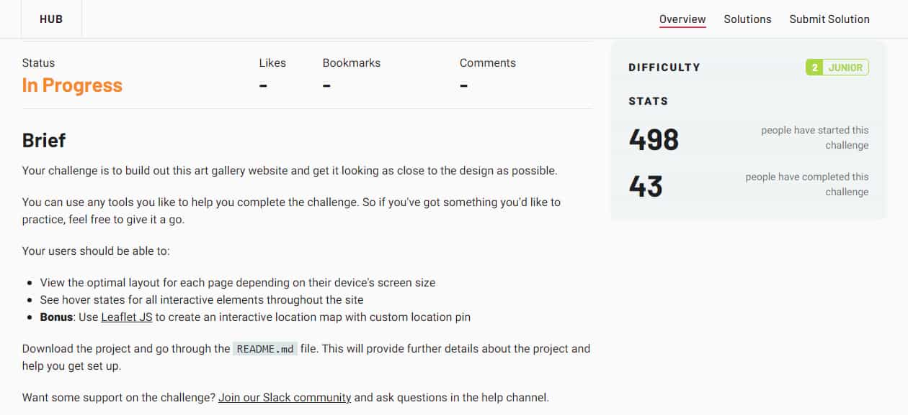
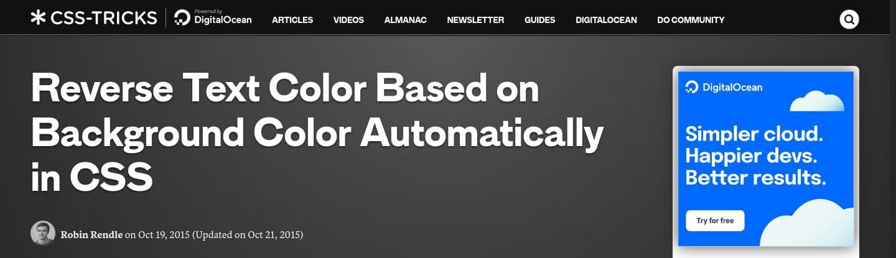
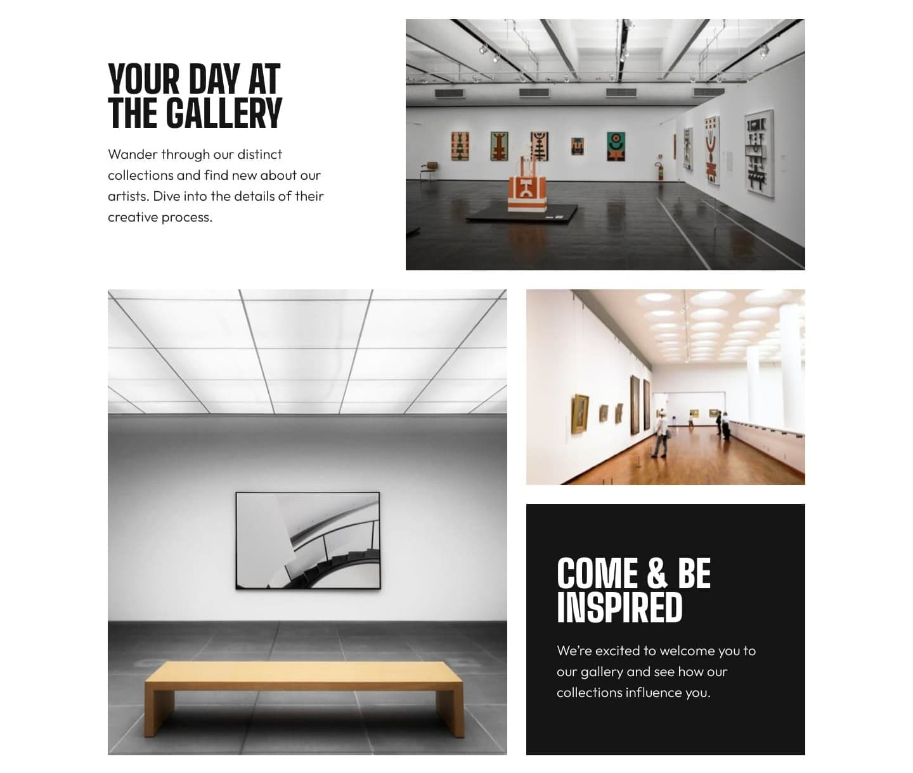
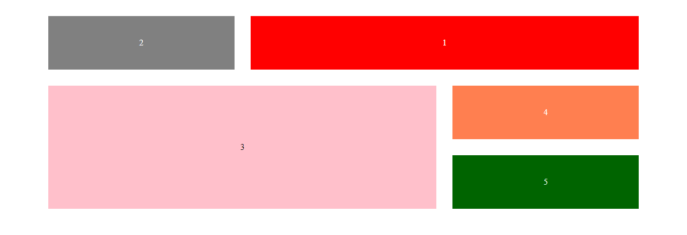
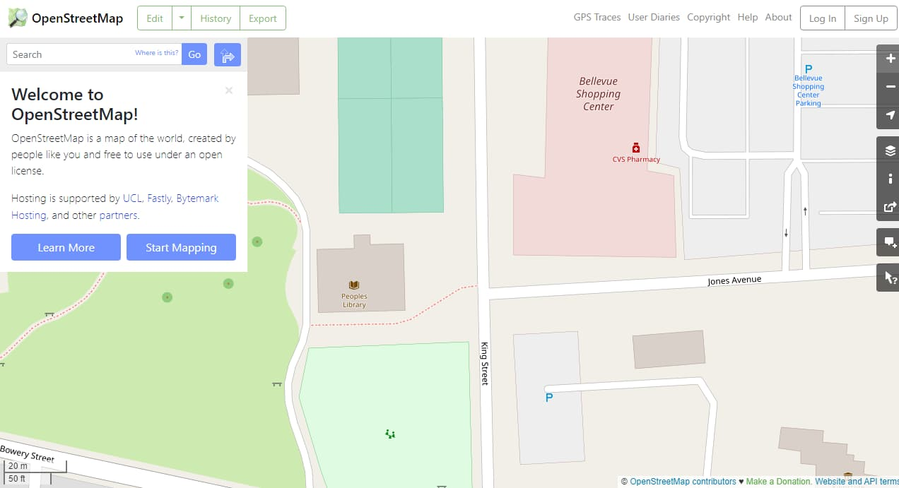
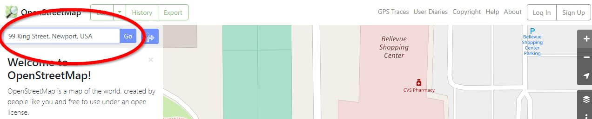

<p align="left">
  <a href="https://www.frontendmentor.io/challenges?difficulties=2"></a>
  
  <a href="https://twitter.com/vanzasetia"></a>
  
  
  
</p>

<p>
  <a href=https://jigsaw.w3.org/css-validator/validator?uri=https%3A%2F%2Fofficialartgallery.netlify.app%2F&profile=css3svg&usermedium=all&warning=1&vextwarning=&lang=en">
    
    </a>
    <a href="https://github.com/standard/semistandard">
      
    </a>
</p>

# Art Gallery Website

## Table of contents
- [Overview](#overview)
  - [Introduction](#introduction)
  - [The challenge](#the-challenge)
  - [Links](#links)
  - [Screenshots](#screenshots)
- [My process](#my-process)
  - [Built with](#built-with)
  - [Fun Fact](#fun-fact)
  - [What I learned](#what-i-learned)
  - [Useful resources](#useful-resources)
- [Author](#author)
- [License](#license)
- [References](#references)

## Overview
[(Back to top)](#table-of-contents)

### Introduction
Welcome to the `README.md` of this repo! The purpose of creating this project is to sharpen my coding skill.

Here, I will tell you everything, starting from the tools I used and much more!

That's it for the introduction! **Happy reading!**
### The Challenge

My challenge is to build out this art gallery website and get it looking as close to the design as possible.

My users should be able to:

- View the optimal layout for each page depending on their device's screen size
- See hover states for all interactive elements throughout the site
- See visible focus states for interactive elements when navigating by keyboard
- Understand and be able to navigate page content while using assistive technology
- **Bonus**: Use Leaflet JS to create an interactive location map with a custom location pin

### Links
- [Live Review](https://officialartgallery.netlify.app/)
- [Live Review (no leaflet)](https://noleaflet.netlify.app/)
- [Frontend Mentor Solution Page](https://www.frontendmentor.io/solutions/art-gallery-website-leaflet-js-rJbPrss85)

### Screenshots

Here are the links. I use links instead of attaching the screenshots here because they are huge.

- [Desktop home page](./screenshots/desktop-home.jpg)
- [Desktop location page](./screenshots/desktop-location.jpg)
- [Mobile home page](./screenshots/mobile-home.jpg)
- [Mobile location page](./screenshots/mobile-location.jpg)

## My Process
[(Back to top)](#table-of-contents)

### Built With
- **Following best practices**\* 
- HTML Semantic Tags
- [BEM (Block, Element, Modifier)](https://sparkbox.com/foundry/bem_by_example) Class *Naming Convention*
- [Sass](https://sass-lang.com/)
- CSS Flexbox
- [Leaflet](https://leafletjs.com/) - a JavaScript library for interactive maps
- CSS Grid - specifically `grid-template-areas` for the home page
- Mobile-first workflow

> \* I follow guidelines. [See what guidelines that I follow.](./docs/README.md#guidelines)

### Fun Fact

#### Small amount of people



So, by the time I started the challenge, 498 people had started the challenge. But, only 43 people have finished the challenge. It means only **8.6%** of people who started the challenge could finish the challenge. 

Interesting...

### What I Learned

#### `mix-blend-mode` Text


So, this is the first problem I encountered while doing the challenge.

I didn't know what should I do. So, just like any other good developer, I search for the answer on the internet. 😉

After a quick searching on the internet, I found this [article by CSS Tricks, *Reverse Text Color Based on Background Color Automatically in CSS | CSS-Tricks*](https://css-tricks.com/reverse-text-color-mix-blend-mode/).



Once I read the article, I knew the "magic trick". It's the `mix-blend-mode: difference;`.

```css
.text:after {
  /* This value is the opposite color of our background */
  color: rgb(0, 255, 255); 
  mix-blend-mode: difference;
}
```

So, by applying to the actual project. Now, everything looks fine.

But, wait a minute!


The grandma's hair also changes the text color! Well, it is out of my control. 😂

Anyway, just to let you know that I'm changing the black background color from almost black to pure black. That is because, with almost black color, the text will be gray instead of white.

The original black color code is `rgb(21, 21, 21)`. I changed it to `rgb(0, 0, 0)`.

#### Grid

It's not the normal grid. It's the grid area. 😂

At first, I wanted to use flexbox to solve the problem because I didn't fully understand grid. But, I decided to give it a try.

By the way, I'm talking about this part.



So, again just like any good developer, I search about CSS Grid on the internet.

I found the [CSS Tricks article about CSS Grid](https://css-tricks.com/snippets/css/complete-guide-grid/). I straightly read about `grid-template-areas`. Once I finished reading it, I still did not fully understand it.

So, I created a [prototype](https://en.wikipedia.org/wiki/Prototype).



At that time, I thought I was ready. So, I gave it a shot on the actual project. It didn't work as expected.

On the prototype project, the CSS was simple. I just used the `repeat()` function.

```css
body {
  display: grid;
  align-items: stretch;
  grid-template-columns: repeat(3, 1fr);
  grid-template-rows: repeat(3, 1fr);
  grid-template-areas:
    "second first first"
    "third third fourth"
    "third third fifth";
  grid-gap: 30px;
}
```

So, I had to think again about it.

After several hours of thinking, I finally managed to create it. Here's the code snippet.

```css
.features .container {
  grid-template-areas:
    "card-white image-grid-1 image-grid-1"
    "image-grid-2 image-grid-2 image-grid-3"
    "image-grid-2 image-grid-2 card-black";
  grid-template-rows: 1fr auto 1fr;
  grid-template-columns: 1fr 10rem 1fr;
  gap: 0.6875rem;
  align-items: stretch;
}
```

So, the `grid-template-columns` needs some customizations. It's because the middle column is not having the same value as the first and the last column.

#### Map

This was the first time I created a map. So, yeah, let's see how I did implement the map.

But, before I started telling my journey, let me tell you what is Leaflet. It's a *JavaScript library* that is used to create interactive maps.

> JavaScript library is the pre-written JavaScript code that can be used to make our lives as a developer easier. As simple as that. If you don't like my definition, you can [see the Wikipedia definition](https://en.wikipedia.org/wiki/JavaScript_library). 😉

Now, let's get into the topic.

First, I read the [quick start guide](https://leafletjs.com/examples/quick-start/). After following the tutorial, I was able to create my first map. This was done for learning purposes.

After that, I tried to implement it on the actual project and it turned out to be a disaster. The map didn't show up.

```javascript
// copy-paste from the documentation 
// link: https://leafletjs.com/reference.html#map-example
const map = L.map("js-map", {
  center: [51.505, -0.09],
  zoom: 13
});
```

I fixed it by adding the following code.

```javascript
L.tileLayer("https://{s}.tile.openstreetmap.org/{z}/{x}/{y}.png", {
  attribution: "© OpenStreetMap"
}).addTo(map);
```

Now, I realized that the map would not show up without the above code. And yeah, [the documentation had also said about it](https://leafletjs.com/reference.html#tilelayer).

> Used to load and display tile layers on the map. [...]

Now, the map is pointing at another location. So, I needed to find the geographical coordinates for "99 King Street, Newport, USA".

After some research on the internet, I finally found it. The way I did it was the following.

1. I visited the official website for [OpenStreetMap](https://www.openstreetmap.org/)



2. I typed on the search bar "99 King Street, Newport, USA". Then, I clicked "Go".



3. I saw the URL had some numbers. I got this URL, [https://www.openstreetmap.org/search?query=99%20King%20Street%2C%20Newport%2C%20USA#map=19/41.48214/-71.31051](https://www.openstreetmap.org/search?query=99%20King%20Street%2C%20Newport%2C%20USA#map=19/41.48214/-71.31051).

4. I directly grabbed those numbers and put them into the array.

```javascript
const map = L.map("js-map", {
  center: [41.48214, -71.31051],
  zoom: 13
});
```

Now, the map pointed to the place that I wanted. 🥳

I think that's it. The rest of the process of creating the map, it's pretty straightforward.

### Useful Resources

- [Reverse Text Color Based on Background Color Automatically in CSS | CSS-Tricks](https://css-tricks.com/reverse-text-color-mix-blend-mode/) - This is an amazing article that helped me create the reverse text color with `mix-blend-mode`. I'd recommend it to anyone who is currently doing the challenge. 
- [OpenStreetMap](https://www.openstreetmap.org/) - This website helps me to get the coordinate numbers for 99 King Street, Newport, USA.

## Author
[(Back to top)](#table-of-contents)

- Frontend Mentor - [@vanzasetia](https://frontendmentor.io/profile/vanzasetia)
- Twitter - [@vanzasetia](https://twitter.com/vanzasetia)
- Code Newbie - [@vanzasetia](https://community.codenewbie.org/vanzasetia)
- Want to see me on other platform? [Check my linktree!](https://linktr.ee/vanzasetia)

## License
[(Back to top)](#table-of-contents)

>You can check out [the full license](./LICENSE)

This project is shared under the MIT license.

## References

[(Back to top)](#table-of-contents)

> See the [documentation.](./docs/README.md)
